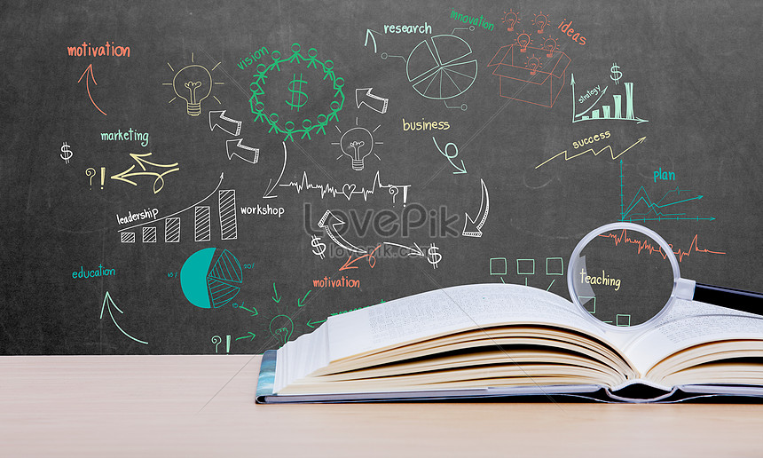
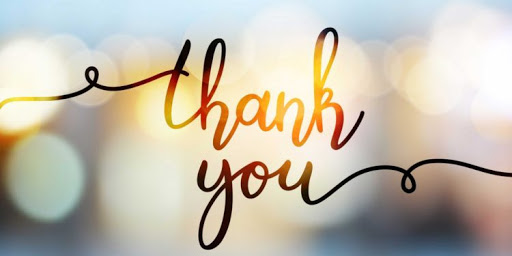

Learning through Failure  

Through this class, my approach to history has expanded so much more than the traditional bubble. Now, I at least know where to do some basic analysis of data rather simply relying on secondary sources on the world wide web. Because of this shift in focus, I have more understanding towards how to form my future research papers. 

Since, I came into history and theory of architecture in my third year, I did not have a long time to formulate a good foundation. I am still in the process of learning and this class has been a great experience in that it has made me more aware of my shortcomings and how to better improve upon them.  

Throughout the weeks, I have analyzed primary sources through digital history methods from a historical perspective. I am also better equipped to conduct research independently as well as in a collaborative working environment. I am proud of myself for being able to ask for help when before I would have not voiced out my concerns. I am more aware of the importance of data specially to filter and choose the necessary ones for aiding in research. 

I have also learned to be a patient reader. Previously, I used to browse through my readings because I did not have much time to fully read them (an excuse for my procrastination). This class gave me the opportunity to try out new ways of notetaking such as using hypothesis… which I think worked better for me in keeping track of results and working process. I even switched from writing by hand to typing. That was huge deal for me because I am someone that does not love using computer for everything especially for notetaking… I have realized that times are changing, and I have to go with the flow to get the best out of an opportunity to learn. If that means changing my habits to accommodate my work, then that will be what I do. I believe this shift was necessary for the upcoming semester, which will probably happen all online. Through learning and experience all these new digital applications, I have come to gain useful tools that can be used in my classes.  

Even though I had a lot of growth, it was not without failure. A block that I encountered during my exercise was setting up the directory. I remember every time, I had to do that, I would have a hard time trying to set it up. Another one of my glorious failure would be the topic modeling which was one of the hardest exercises I had come across in the class. I had made a mistake that cost me to fall behind all because I did not save the file properly which resulted in the data being changed. 
The final week 6 helped tie everything we learned in the course to form an end product that showcased our process. I ended up trying it all out and finally choosing the static website which turned out nice. 
This week was hectic because I was doing the final exercise in a time crunch. But it went way better than I expected. I chose the women travel diaries and focused on Mary McMillan who traveled all across the world and even stayed for a long period of time in Hiroshima, Japan.

I think week 6 was also when everything came together for me because it involved putting together the applications that we had learned before and choosing where to focus on your topic of interest. I think that has made it easier for me to know how the application functions better than when I was using files and documents created by the prof. I wish we had gotten to try applications with a research topic of our interest from the beginning. Although, that would have made it harder, but I think it would have been easier to understand the instructions and how they are relevant to the data.  

One of my regrets is not being more vocal as I did not want to sound ignorant. I did ask for help when I really needed it and the class was really amazing in helping me get through any issues when I had them. And other times, I would just go through the discord app and find the answers to my questions. 

When I first chose this class, I thought of simply though that I would learn new ways to research which I did but it was so much more than that… It has helped me expand my view on what can be defined as history and I will always take into consideration approached outside of the traditional methods when doing my class and in my career in the field. I know that I will be using Voyant, Wget, RStudio along with other relevant application in my future research or essays.

Lastly, if I were to mark myself, I think I should be around A- because I felt like I got most of the exercises completed. I kept track of what I did and reflected on my process. I tried my best to engage with my classmates and I got out of my comfort zone to ask for help when needed. I believe my submissions from week 1 to week 6 showcase how much I have improved throughout the course in terms of my analytical ability, methodology or even argumentation. I am proud of how far I have as someone who did not even know what digital history meant and was trying to avoid programming. I have done my best in all the weekly exercises to be professional and organized. My journey in this class was a great learning experience where I came to see my failures as a tool to learn. I have discovered that I do not need to focus on my results or success to feel satisfied instead, the process of understanding my mistakes have made me feel more accomplished and satisfied. I know this has made be a better student and a future historian. 
             
   
